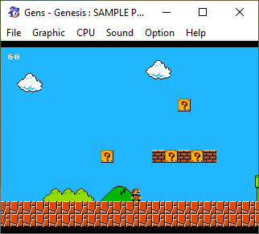

# Описание
В качестве эксперимента, игра для Sega Megadrive/Genesis,
написана на C и с использованием SGDK.

# Сделано
1) Движение персонажа
2) Загрузка карты (тайлест)
3) Обработка столкновений
4) Анимация
5) Скроллинг карты
6) Звук
